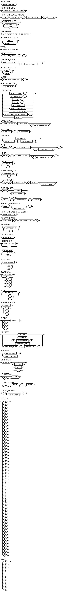

A linguagem desenvolvida se chama Balbismo. Ela foi criada para facilitar calculos matematicos.

Com isso em mente, a linguagem tem suporte a números int e float. Além disso, ela possui suporte a arrays.
A linguagem também possui suporte a funções, que podem ser recursivas.
Para possibilitar a entrada e saída de dados, a linguagem possui suporte a funções como scanf e printf de C.

A gramatica linguagem balbismo é definida por este EBNF:
```
PROGRAM = FUNCTION_LIST ;

FUNCTION_LIST = FUNCTION_DECLARATION, { FUNCTION_DECLARATION } ;

FUNCTION_DECLARATION = TYPE, IDENTIFIER, '(', PARAMETER_LIST, ')', BLOCK ;

PARAMETER_LIST = [ PARAMETER, { ',', PARAMETER } ] ;

PARAMETER = PARAMETER_TYPE, IDENTIFIER ;

PARAMETER_TYPE = TYPE | ARRAY_TYPE ;

TYPE = PRIMITIVE_TYPE ;

ARRAY_TYPE = PRIMITIVE_TYPE, '[', ']' ;

VARIABLE_TYPE = PRIMITIVE_TYPE, [ '[', EXPRESSION, ']' ] ;

PRIMITIVE_TYPE = 'int' | 'float' ;

BLOCK = '{', STATEMENT_LIST, '}' ;

STATEMENT_LIST = { STATEMENT } ;

STATEMENT =
    DECLARATION, ';'
  | ASSIGNMENT, ';'
  | PRINT, ';'
  | INPUT, ';'
  | IF_STATEMENT
  | WHILE_STATEMENT
  | RETURN_STATEMENT
  | FUNCTION_CALL_STATEMENT, ';'
  | BLOCK
  ;

DECLARATION = VARIABLE_TYPE, IDENTIFIER, [ '=', EXPRESSION ] ;

ASSIGNMENT = VARIABLE, '=', EXPRESSION ;

VARIABLE = IDENTIFIER | IDENTIFIER, '[', EXPRESSION, ']' ;

PRINT = 'printf', '(', STRING_LITERAL, [ ',', EXPRESSION_LIST ], ')' ;

INPUT = 'scanf', '(', STRING_LITERAL, [ ',', VARIABLE_LIST ], ')' ;

VARIABLE_LIST = VARIABLE, { ',', VARIABLE } ;

EXPRESSION_LIST = EXPRESSION, { ',', EXPRESSION } ;

IF_STATEMENT = 'if', '(', EXPRESSION, ')', BLOCK, [ ELSE_CLAUSE ] ;

ELSE_CLAUSE = 'else', ( BLOCK | IF_STATEMENT ) ;

WHILE_STATEMENT = 'while', '(', EXPRESSION, ')', BLOCK ;

RETURN_STATEMENT = 'return', [ EXPRESSION ], ';' ;

FUNCTION_CALL_STATEMENT = FUNCTION_CALL ;

FUNCTION_CALL = IDENTIFIER, '(', ARGUMENT_LIST, ')' ;

ARGUMENT_LIST = [ EXPRESSION, { ',', EXPRESSION } ] ;

EXPRESSION = LOGICAL_OR ;

LOGICAL_OR = LOGICAL_AND, { '||', LOGICAL_AND } ;

LOGICAL_AND = EQUALITY, { '&&', EQUALITY } ;

EQUALITY = RELATIONAL, { ( '==' | '!=' ), RELATIONAL } ;

RELATIONAL = ADDITIVE, { ( '>' | '<' | '>=' | '<=' ), ADDITIVE } ;

ADDITIVE = MULTIPLICATIVE, { ( '+' | '-' ), MULTIPLICATIVE } ;

MULTIPLICATIVE = UNARY, { ( '*' | '/' | '%' ), UNARY } ;

UNARY = [ ( '+' | '-' | '!' ) ], PRIMARY ;

PRIMARY =
    VARIABLE
  | NUMBER
  | '(', EXPRESSION, ')'
  | FUNCTION_CALL
  | PRIMITIVE_TYPE, '(', EXPRESSION, ')'
  ;

NUMBER = INT_LITERAL | FLOAT_LITERAL ;

IDENTIFIER = LETTER, { LETTER | DIGIT | '_' } ;

INT_LITERAL = [ '-' ], DIGIT, { DIGIT } ;

FLOAT_LITERAL = [ '-' ], DIGIT, { DIGIT }, '.', DIGIT, { DIGIT } ;

STRING_LITERAL = '"', { CHARACTER }, '"' ;


LETTER = 'A' | 'B' | 'C' | 'D' | 'E' | 'F' | 'G' | 'H' | 'I' | 'J' | 'K' | 'L' | 'M' |
          'N' | 'O' | 'P' | 'Q' | 'R' | 'S' | 'T' | 'U' | 'V' | 'W' | 'X' | 'Y' | 'Z' |
          'a' | 'b' | 'c' | 'd' | 'e' | 'f' | 'g' | 'h' | 'i' | 'j' | 'k' | 'l' | 'm' |
          'n' | 'o' | 'p' | 'q' | 'r' | 's' | 't' | 'u' | 'v' | 'w' | 'x' | 'y' | 'z' ;

DIGIT = '0' | '1' | '2' | '3' | '4' | '5' | '6' | '7' | '8' | '9' ;
```

E este é o diagrama sintático da linguagem Balbismo:


